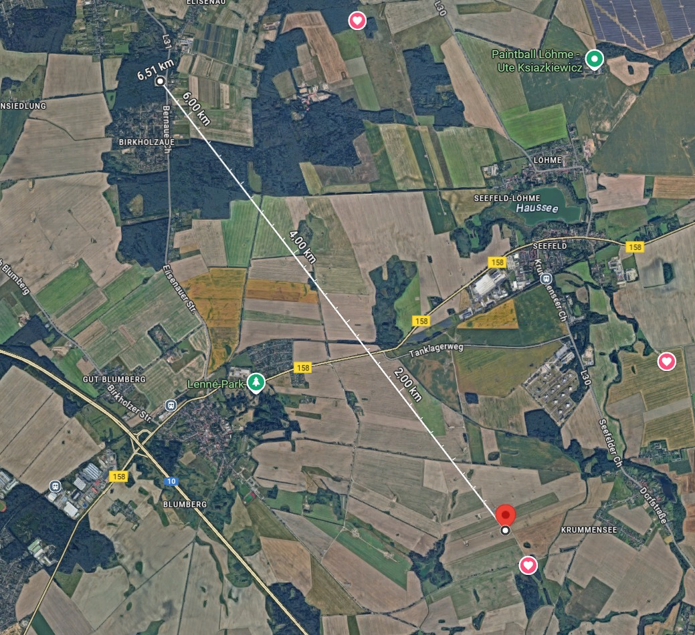

# FlyWeb
FlyWeb is a startup focusing on disrupting the last mile delivery market.

currently the project is in the early prototype phase.

## Progress

Building a delivery network requires a drone that can carry a payload.
That is why my first steps were to build a rather large drone and get to know the nature of x-class UAVs.

This was the first approach at building a Quadcopter with a 10 inch diameter.

  

Here you can see the drone flying

  
  
  

I also set myself up to build a Li-ion pack for higher density in energy capacity
(fpv drones are usually flown with Lipo cells that excell in high discharge rates)

This is how I built an 18650 6s2p 5000mah 40A battery

  
  
  
  

and I also built a 21700 6s2p 8000mah 80A battery

  
  
  
  

## Long range Test

I wanted to see if Ican really push the drone to fly over a long distance, and what can I say, a 13km roundtrip with a lot of leeway in battery percentage, so it was a success indeed :).

  
  

  

## Learnings

### importance of a good pid tune
the biggest lesson I learned when building a non standart fpv how crucial it is to have well tuned PIDs for the flight performance.
An out of tune quad not only means, that the control signals wont be translated cleanly to the position of the drone, but also leads to oscillations, which is a big problem.
In my case a simple hover already caused the motors to be burning hot and the insulating layer of the copper windings charred a bit.
My motors werent able to handle the rapid acceleration and deceleration of the oscillations mandated by the pid controller and heated up to the point of damaging themselves. A possible fix would be to upgrade the stator volume of the motors, which would give some leeway, but that will lead to heavier motors and a heavier drone, which if detremental to efficiency.
Having the right pid tune can even make undersized motors perform exceptionally, so it important to have it in mind at any time.

### Amperage leeway
Even though the drone pulls about 10-20 Amps when cruising, the battery for this drone should be able to provide at least 60A.
the power to speed ratio of motors is not linear, so a double in speed will not equate to a double in wattage.
therefore especially on takeoff or sharp moves, the quad can pull up to 120 Amps.
having used the 18650 6s2p battery, that could only deliver 40A (stated by the datasheet) also lead the drone to oscillate and burn the motor. I assume the lack of amperage needed amperage led to the pid controller and the motors to get out of sync.

 
 ### low discharge is better than high discharge
 (C Rating quickly explained: 3c= can discharge from full to empty in 1/3h, and 20c = from full to empty in 1/20h)

 When researching about the li-ion cells I found out that there is a trilemma between cycle life, C rating and capacity.
 Cells with a C rating  of 10-20 usually had a cycle life of only 200-300 Cycles degrading the capacity to 60-80% capacity, while cells with a C rating of only 2-3 the cycle life jumps up to 500-800 Cycles degrading the battery to 80-90%.
 This will mean the difference between a drone battery lasting for less than a year and lasting for several years.
 it is important to note that this is in direct contradiction to the Amperage leeway point, so this will be an important dilemma to optimize for.

## Next Steps

my next step is to build a 10 inch drone on a Hex frame, to incoorporate more motors for redundancy and perform the first test delivery.

  

