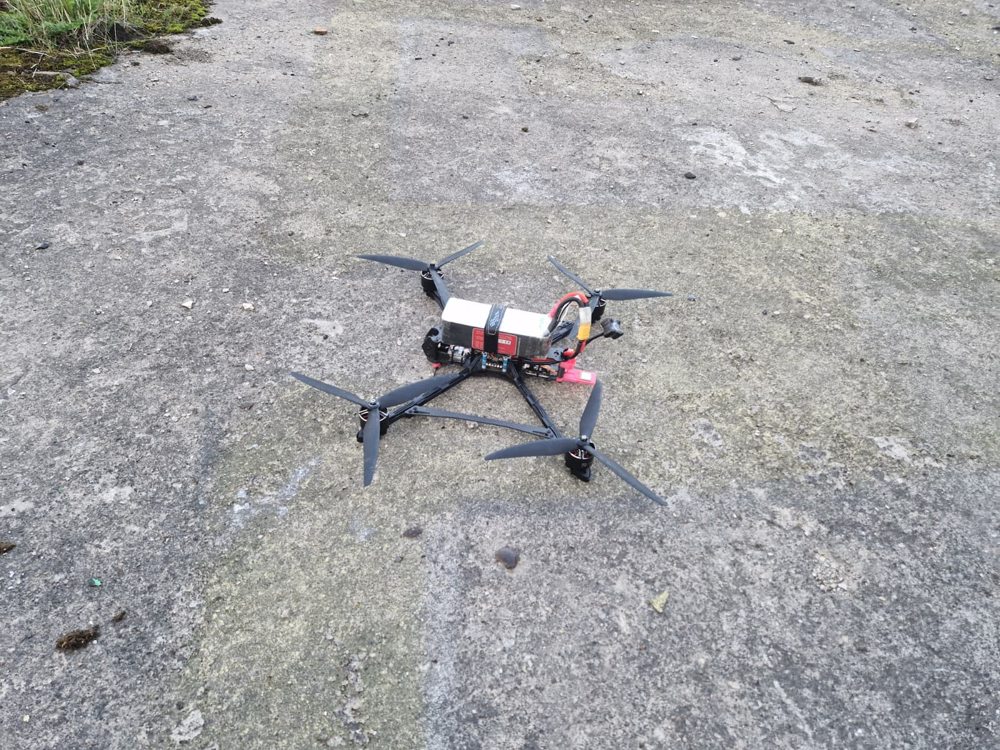

# flyweb
FlyWeb is a startup focusing on disrupting the last mile delivery market.

currently the project is in the early prototype phase.

## Progress

Building a delivery network requires a drone that can carry a payload.
That is why my first steps were to build a rather large drone and get to know the nature of x-class UAVs.

This was the first approach at building a Quadcopter with a 10 inch diameter.
